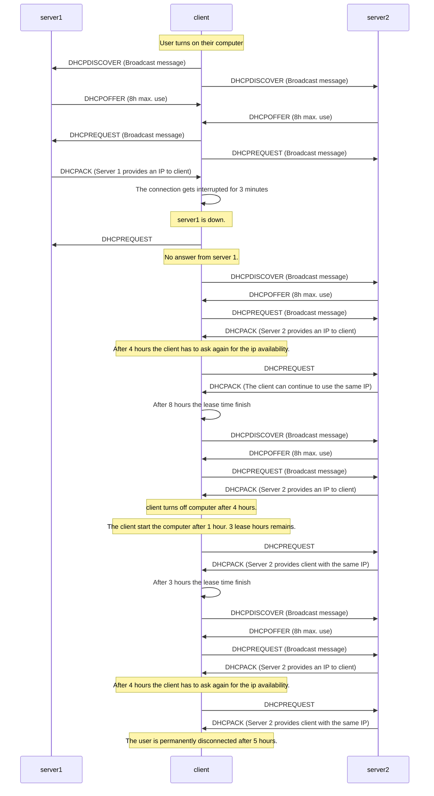

# DHCP Schema

**Our diagram is based on the following assumption:**

A new user joins a network. We assume the network has 2 DHCP servers. 

- The user sits at their machine and turns on their computer. 
- They work for 1 hour connected to DHCP server #1. 
- The user experiences a 3-minute outage. The user reconnects to the network after 3 minutes. Server #1 is down. 
- The user remains active for 12 hours. 
- The user disconnects for 1 hour. 
- The user reconnects to the network.
- The user stays on the network for 5 hours and then disconnects permanently.

 

>[!NOTE]
> *We assume that our **DHCP server** operates with average lease times (8 hours).*

## Diagram

